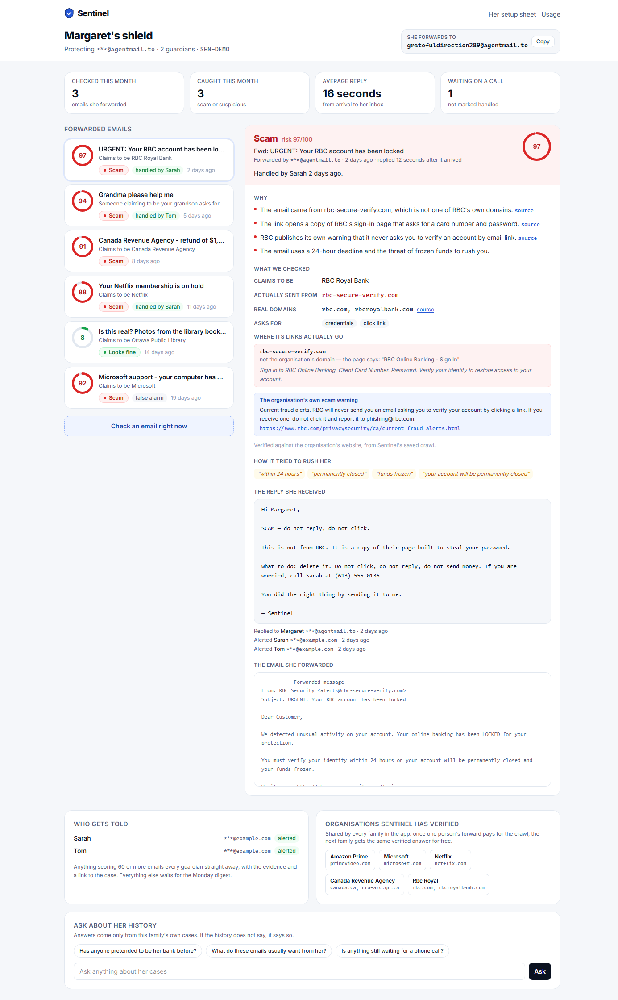
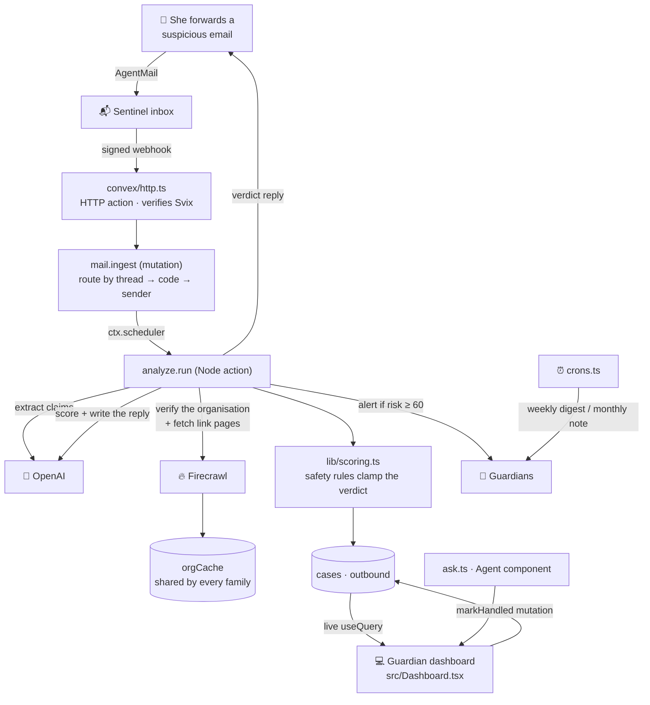
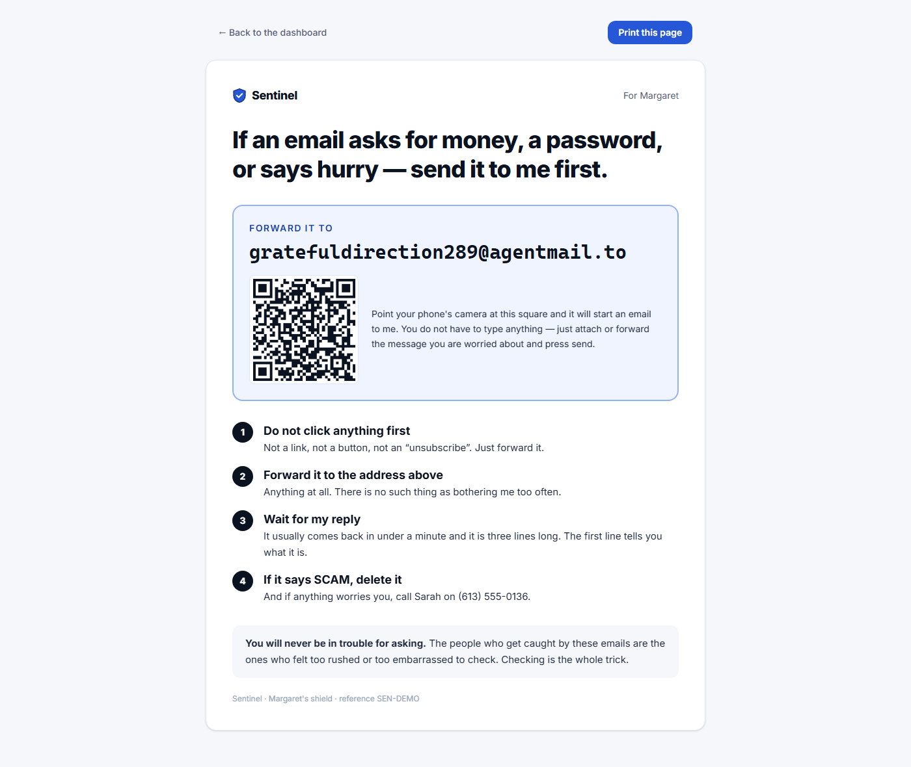

# 🛡️ Sentinel

_A scam shield for your parent's inbox. She forwards anything that asks for money, a password, or hurry — and gets a plain, kind answer back before she can be talked into clicking._

🌐 **[Live demo](https://grateful-minnow-9.convex.site)** · 🎬 Demo video: `TODO: video link` · 📓 [Build log](hackathon.md) · Built for the **Convex All Gas Hackathon**

> ⚠️ The live demo runs on free tiers of Convex, OpenAI, Firecrawl and AgentMail. If traffic is high some features may be rate-limited or fall back to saved crawl results — the demo video shows the full flow.

## ✨ In three lines

It is one email address an older adult forwards anything frightening to, and gets a three-line verdict back.
It is for the adult children who cannot read their mother's inbox for her, but could be a phone call away if they knew.
The moment worth building it for: her phone buzzes with **"SCAM — do not reply, do not click"** while her daughter's dashboard turns red across town.



## 😩 The problem

Older adults lose billions a year to email fraud: fake bank lockouts, "your grandson is in jail, send gift cards", tax-refund threats, tech-support pop-ups. The advice we give them — "look at the sender's domain", "hover the link, don't click it" — asks a 78-year-old to do forensic work on a screen designed to hide exactly that information, while an email screams that her account closes in twelve hours. Her children cannot read her inbox for her, and she often will not mention it until the money is gone, because the whole scheme is engineered to make her feel rushed and embarrassed.

The real failure is not that she cannot tell. It is that in the sixty seconds when it matters, there is nobody to ask.

## 💡 Our solution

- **Give her one rule instead of a checklist.** "If it asks for money, a password, or hurry — forward it to Sentinel." Forwarding is the entire interface; there is no app for her to learn, no password for her to lose.
- **Print the rule for her fridge.** Every shield gets a one-page setup sheet with the address in huge type and a QR code that opens a pre-addressed email on her phone.
- **Check the claim against the real world.** Sentinel reads what the email claims to be, then goes and looks at that organisation's actual website to find out which domains it really owns — and fetches the link's landing page to see what it is really asking for.
- **Answer in three lines, in her language.** A verdict line, one plain sentence about who it is really from, and the one thing to do. Typically back in her inbox in under half a minute.
- **Wake the family up.** Anything scoring 60 or more emails every guardian immediately with the evidence and a link to the case, so somebody can pick up the phone.
- **Close the loop.** A guardian marks the case *handled* and the row turns green live on every other screen. Monday morning the family gets a digest; the first of the month she gets a short note telling her the habit is working.

## 🧩 How we use the sponsors

| Sponsor | What it does in Sentinel | Where |
|---|---|---|
| ⚡ Convex | The whole backend: schema and indexes, live queries, mutations, actions, scheduler, crons, HTTP actions, Convex Auth, the Agent and Rate Limiter components, and static hosting of the site itself | `convex/` |
| 🧠 OpenAI | Reads the forwarded email and extracts what it claims to be, picks the organisation's genuine domains out of search results, scores the risk with cited reasons, writes the sentence she reads, and answers the guardians' questions | `convex/lib/llm.ts`, `convex/analyze.ts`, `convex/ask.ts` |
| 🔥 Firecrawl | Searches for the organisation's official site and its own fraud-warning page, and fetches the landing page behind every suspicious link — in Firecrawl's sandbox, never from our runtime | `convex/lib/firecrawl.ts`, `convex/analyze.ts` |
| 📬 AgentMail | Runs the inbox she forwards to, receives her mail through a signed webhook, replies to her in the thread, and alerts the guardians and sends the digests | `convex/mailActions.ts`, `convex/mail.ts`, `convex/http.ts` |

### ⚡ Convex

Sentinel is a Convex app end to end — the browser talks to nothing else, and every sponsor key lives only on the deployment.

- **Schema and indexes** (`convex/schema.ts`): `shields`, `guardians`, `cases`, `orgCache` and `outbound` alongside the mail plumbing, with an index behind every lookup (`by_shield_and_receivedAt`, `by_slug`, `by_orgKey`, `by_email`, `by_mailMessage`, …). Extraction and verification are stored as validated objects, not blobs.
- **Live queries** (`convex/cases.ts`, `convex/shields.ts`, `convex/orgs.ts`): the dashboard is `useQuery` all the way down — case list, evidence panel, stat tiles, verified-organisation strip. Nothing polls. A case row appears the instant an email lands and fills in as each stage of the analysis writes back.
- **Mutations with an optimistic update** (`cases.markHandled`, wired in `src/Dashboard.tsx`): the guardian's primary action — "I called her" — turns the row green before the round trip finishes, then reconciles.
- **Actions across two runtimes** (`convex/analyze.ts`, `convex/mailActions.ts`, `convex/ask.ts` in Node; `convex/digest.ts` in the default runtime): everything that spends a sponsor credit is an action, never a query.
- **Scheduler** (`ctx.scheduler.runAfter` in `convex/mail.ts` and `convex/cases.ts`): the webhook returns 200 immediately and schedules the analysis, so AgentMail never waits on a model.
- **Crons** (`convex/crons.ts` → `convex/digest.ts`): a Monday guardian digest and a monthly note to the protected person, both of which skip families with nothing to report.
- **HTTP actions** (`convex/http.ts`): the signed AgentMail webhook at `/api/agentmail/webhook`, plus Convex Auth's routes, with static hosting registered as the catch-all so deep links like `/s/<slug>` work cold.
- **Convex Auth** (`convex/auth.ts`): anonymous sign-in as the primary path so a judge never meets a login wall, with password sign-in for coming back. Shields are owned by the signed-in user; the family dashboard is reachable by an unguessable slug, which is the capability the family shares.
- **Components in real use**: `@convex-dev/agent` powers the guardian Q&A over the family's own history (`convex/ask.ts`), `@convex-dev/rate-limiter` guards every credit-spending path with a per-user *and* a global limit (`convex/lib/limits.ts`), and `@convex-dev/static-hosting` serves this site at `*.convex.site`.

### 🧠 OpenAI

OpenAI does four separate jobs, each with a narrow contract and a Zod schema (`convex/lib/llm.ts`). First it reads the forwarded email — usually a messy forward with the real sender buried in the body — and extracts the claimed organisation, the original sending address, every link, what the email is asking for, and the phrases used to rush her. Then, given real search results, it picks out which domains the organisation genuinely owns; it is only ever allowed to choose from URLs Firecrawl actually returned. Then it scores the risk and writes the reasons, citing the evidence URLs it was handed. Finally it writes the single sentence the parent reads — and only that sentence: the verdict line and the instruction are assembled in code (`convex/lib/scoring.ts`) so a chatty model can never bury the answer. The model that produced each case is stored on the row.

### 🔥 Firecrawl

Firecrawl is what makes the verdict evidence instead of opinion (`convex/analyze.ts`). For each case it runs two searches in parallel — the organisation's official site, and its own "current scams" page — and then fetches the landing page behind up to two suspicious links, so we can say what the page actually asks for without ever loading a phishing page in our own runtime. A fraud-warning page is only cited when it sits on a domain we just verified as the organisation's own. Findings are written to a shared `orgCache`, so the first family to forward a fake bank email pays for the crawl and every family after them gets the same verified answer for free. All calls go through one budgeted gateway (`convex/lib/firecrawl.ts`) that serves a stored result when it has one and refuses to spend below a reserved credit floor; when that happens the dashboard says so honestly rather than looking broken.

### 📬 AgentMail

AgentMail is the product's front door (`convex/mailActions.ts`, `convex/mail.ts`, `convex/http.ts`). One inbox receives everything; a signed Svix webhook verifies each delivery, and `mail.ingest` routes it by thread id, then by the `[SEN-XXXX]` code in the subject, then by the sender's registered address — the protected person and every guardian are routing keys, which is how "just forward it" can be the whole interface. Nothing is ever dropped silently: unmatched mail lands in an operator list. Outbound, AgentMail sends her the verdict reply in the same thread, alerts the guardians above the risk threshold, and delivers the weekly digest and monthly note. Every send goes through one helper that can redirect all mail to a demo address, so building and filming this never risked emailing a real person.

## 🔍 How it works



1. She forwards the email to Sentinel's AgentMail inbox — the address on her fridge sheet (`src/Setup.tsx`).
2. AgentMail posts a signed webhook to `/api/agentmail/webhook`; `convex/http.ts` verifies the signature and returns 200 immediately.
3. `mail.ingest` stores the message and routes it to her shield by thread, subject code, or her registered address, then schedules the pipeline.
4. `cases.intakeFromMail` opens a case in `analyzing` — the row is already on the family's dashboard, live, before any model has run.
5. `analyze.run` asks OpenAI what the email claims to be, and writes that to the case so the panel fills in while the crawl is still going.
6. Firecrawl finds the organisation's real domains and its own scam-warning page, and fetches the landing page behind the links; results land in the shared `orgCache`.
7. OpenAI scores the risk with reasons that cite those URLs, and `lib/scoring.ts` clamps the result — nothing can be called safe without a domain match.
8. AgentMail replies to her with the three-line verdict, and `outbound` records it so the guardians can read exactly what she was told.
9. If the risk is 60 or more, every guardian is emailed with the evidence and a link to the case.
10. A guardian hits *Handled*; the mutation lands optimistically and every other open dashboard turns green in the same second. `crons.ts` takes it from there each week.

**What's realtime:** every list, tile, evidence panel and status chip is a live `useQuery` subscription — nothing in this app polls, and the analysis writes to the case three times as it progresses so the dashboard visibly fills in.

## 🚨 The safety rules

The dangerous failure in a product like this is not calling a real email suspicious. It is telling somebody an email is fine when it is not. So the model's opinion is never the last word (`convex/lib/scoring.ts`):

- A verdict of "looks fine" is only allowed when the sending domain matched a domain we actually found on the organisation's real website. Unverifiable means suspicious, never safe.
- Any email asking for money, credentials, gift cards or remote access is floored at a risk of 60, whatever the model thought.
- A domain that borrows the organisation's name without being one of its domains is floored at 80.
- If the pipeline fails halfway — a model outage, an exhausted quota — the case fails to *suspicious* with a reply that says so, never to silence and never to "fine".
- Her email address is a routing key, not display data: every read path returns a masked address, so it never appears in the dashboard, a screenshot, or this repository.

## 🗂️ Project map

```
convex/
  schema.ts        shields · guardians · cases · orgCache · outbound (+ mail plumbing)
  analyze.ts       the pipeline: extract → verify → score → reply → alert  ("use node")
  cases.ts         live case queries, intake from mail, Handled / False alarm
  shields.ts       create a shield, guardians, masked read paths
  orgs.ts          the shared organisation cache
  ask.ts           guardian Q&A on the Agent component  ("use node")
  crons.ts         weekly digest · monthly note  →  digest.ts
  http.ts          signed AgentMail webhook + auth routes + static hosting
  mail.ts          inbound routing;  mailActions.ts  the only place mail is sent
  seed.ts          the demo family, warmed orgCache, six past cases
  lib/             llm.ts · firecrawl.ts · agentmail.ts · scoring.ts · limits.ts
src/
  Dashboard.tsx    live case list, risk rings, evidence panel, Handled, Q&A
  Setup.tsx        the printable one-pager with the QR code
  Home.tsx         landing + create a shield;  Admin.tsx  free-tier usage
```

## 🚀 Run it yourself

```bash
pnpm install
pnpm dlx convex dev        # creates a deployment and writes .env.local
pnpm dev                   # the app on localhost, talking to your deployment
pnpm run deploy            # build + push + upload to <deployment>.convex.site
```

Set these on the Convex deployment with `pnpm dlx convex env set NAME` — never in the repo, never with a `VITE_` prefix. Names only; see `.env.example`:

`LLM_BASE_URL`, `LLM_API_KEY`, `LLM_MODEL`, `FIRECRAWL_API_KEY`, `AGENTMAIL_API_KEY`, `AGENTMAIL_WEBHOOK_SECRET`, `SITE_URL`, `DEMO_RECIPIENT_OVERRIDE` (redirects all outbound mail while developing), and the optional guards `APP_PAUSED`, `FIRECRAWL_MIN_CREDITS`, `FIRECRAWL_DAILY_CREDITS`.

Then run `pnpm exec convex run mailActions:ensureInbox '{}'` once to create the inbox, point an AgentMail `message.received` webhook at `https://<deployment>.convex.site/api/agentmail/webhook`, and `pnpm exec convex run seed:demo '{}'` to fill the demo family.



## 🙏 Credits

Built for the **Convex All Gas Hackathon** on Convex, OpenAI, Firecrawl and AgentMail. The scam emails in the demo data are reconstructions of the ones that actually circulate — the fraud-warning pages they are checked against are the organisations' own.
